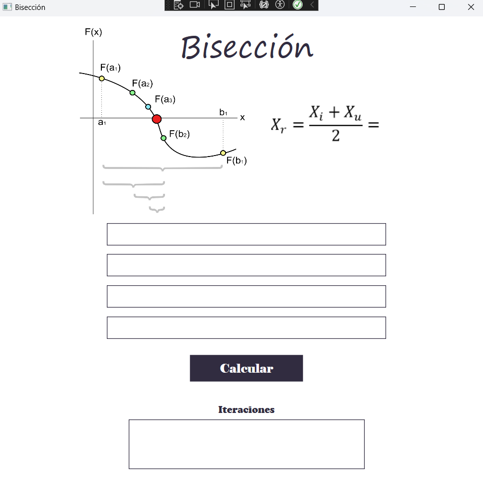
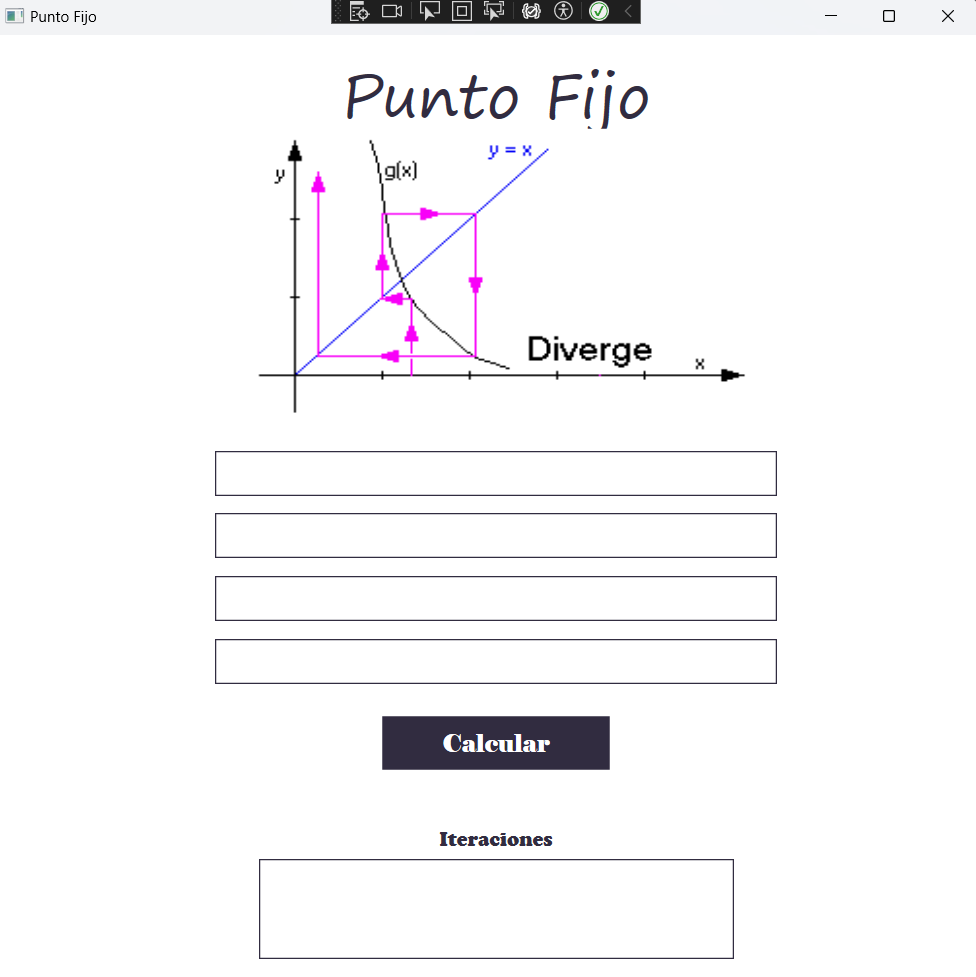
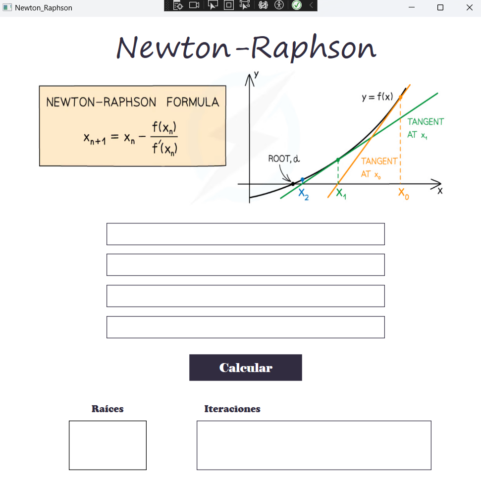

# Calculadora de Ecuaciones V1 (Incompleta)
Este proyecto fue creado para la entrega final del semestre de la materia de Modelos Matemáticos, el propósito de esta práctica fue crear una herramienta que te permite resolver ecuaciones cúbicas y de segundo grado utilizando diferentes métodos numéricos.

Esta es la primera versión del proyecto implementada en C# y Xaml, fue la primera propuesta que se implementó, sin embargo, me di cuenta de que no era muy intuitiva, por lo que decidí crear una segunda versión y dejar está incompleta, que se encuentra en otro repositorio como `calculadora_de_ecuaciones`.

### Métodos Matemáticos:
Los métodos empleados por la calculadora son los siguientes:
* Bisección
* Punto Fijo
* Newton-Raphson
* Secante
* Raíces Múltiples
* Falsa Posición

### Capturas de Pantalla

**Inicio**:

.

**Bisección**:

**Punto Fijo**:

**Newton-Raphson**:

